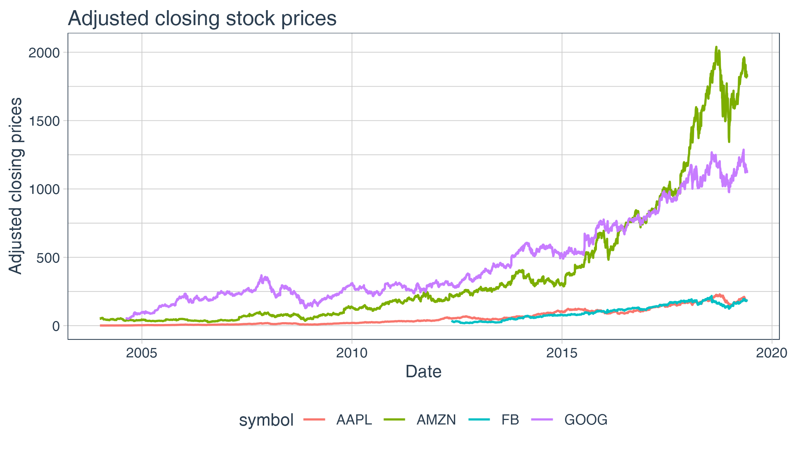
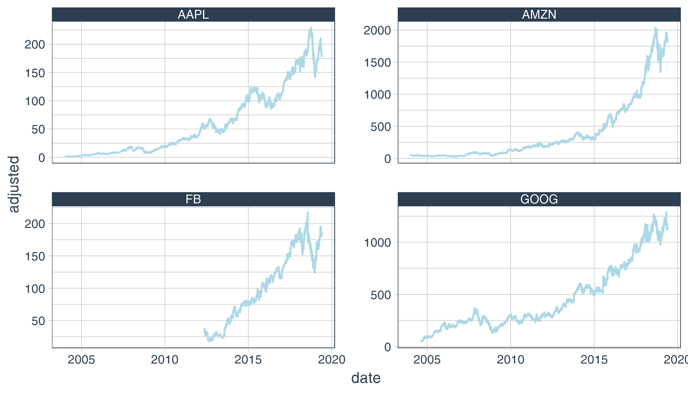
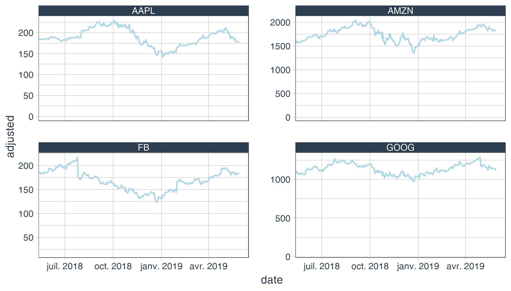

---
authors:
- admin
categories: [R,Time series]
date: "2019-05-30"
draft: false
featured: true
image:
  caption: ""
  focal_point: ""
projects: []
subtitle: 
summary: Time series visualizations
tags: [R, Time series, visualizations]
title: Retrieve stock data with tidyquant
---

```R
options(warn = -1)
suppressPackageStartupMessages(library(tidyverse)) # metapackage with lots of helpful functions
suppressPackageStartupMessages(library(tidyquant))
```

# Retrieve stock data of the GAFA (Google Amazon Facebook Apple)
if you are running this kernel from Kaggle make sure you enable Internet connection in the settings.


```R
start <- "2004-01-01"
end <- "2019-05-30"
GOOG <- tq_get("GOOG", get = "stock.prices", from = start, to = end)
AAPL <- tq_get("AAPL", get = "stock.prices", from = start, to = end)
FB <- tq_get("FB", get = "stock.prices", from = start, to = end)
AMZN <- tq_get("AMZN", get = "stock.prices", from = start, to = end)
```

The stock prics for these companies are now in our current environment.


```R
map(list(GOOG, AAPL, FB, AMZN), class)
```


<ol>
	<li><ol class=list-inline>
	<li>'tbl_df'</li>
	<li>'tbl'</li>
	<li>'data.frame'</li>
</ol>
</li>
	<li><ol class=list-inline>
	<li>'tbl_df'</li>
	<li>'tbl'</li>
	<li>'data.frame'</li>
</ol>
</li>
	<li><ol class=list-inline>
	<li>'tbl_df'</li>
	<li>'tbl'</li>
	<li>'data.frame'</li>
</ol>
</li>
	<li><ol class=list-inline>
	<li>'tbl_df'</li>
	<li>'tbl'</li>
	<li>'data.frame'</li>
</ol>
</li>
</ol>


What is really nice about the tidyquant package is that it returns a tibble we can easily work with.


```R
head(GOOG)
```


<table>
<thead><tr><th scope=col>date</th><th scope=col>open</th><th scope=col>high</th><th scope=col>low</th><th scope=col>close</th><th scope=col>volume</th><th scope=col>adjusted</th></tr></thead>
<tbody>
	<tr><td>2004-08-19</td><td>49.67690  </td><td>51.69378  </td><td>47.66995  </td><td>49.84580  </td><td>44994500  </td><td>49.84580  </td></tr>
	<tr><td>2004-08-20</td><td>50.17863  </td><td>54.18756  </td><td>49.92529  </td><td>53.80505  </td><td>23005800  </td><td>53.80505  </td></tr>
	<tr><td>2004-08-23</td><td>55.01717  </td><td>56.37334  </td><td>54.17266  </td><td>54.34653  </td><td>18393200  </td><td>54.34653  </td></tr>
	<tr><td>2004-08-24</td><td>55.26058  </td><td>55.43942  </td><td>51.45036  </td><td>52.09616  </td><td>15361800  </td><td>52.09616  </td></tr>
	<tr><td>2004-08-25</td><td>52.14087  </td><td>53.65105  </td><td>51.60436  </td><td>52.65751  </td><td> 9257400  </td><td>52.65751  </td></tr>
	<tr><td>2004-08-26</td><td>52.13591  </td><td>53.62621  </td><td>51.99184  </td><td>53.60634  </td><td> 7148200  </td><td>53.60634  </td></tr>
</tbody>
</table>


The columns mean :
- Open : The opening price is the price at which a security first trades upon the opening of an exchange on a trading day
- High : The highest stock price that day
- Low: The stock prince that day
- Close : The closing stock price that day
- Volume: the total of transactions that day
- Adjusted : Adjusted closing price amends a stock's closing price to accurately reflect that stock's value after accounting for any corporate actions. It is considered to be the true price of that stock and is often used when examining historical returns or performing a detailed analysis of historical returns. [Thanks to investopedia](https://www.investopedia.com/terms/a/adjusted_closing_price.asp)

Since I am going to plot the stock prices of these companies, I am going to combine all the dataset into a single dataframe.


```R
GOOG <- GOOG %>% mutate(symbol = "GOOG")
AAPL <- AAPL %>% mutate(symbol = "AAPL")
FB <- FB %>% mutate(symbol = "FB")
AMZN <- AMZN %>% mutate(symbol = "AMZN")

# bind them

stocks <- bind_rows(GOOG, AAPL, FB, AMZN)
```


```R
glimpse(stocks)
```

    Observations: 13,082
    Variables: 8
    $ date     <date> 2004-08-19, 2004-08-20, 2004-08-23, 2004-08-24, 2004-08-2...
    $ open     <dbl> 49.67690, 50.17863, 55.01717, 55.26058, 52.14087, 52.13591...
    $ high     <dbl> 51.69378, 54.18756, 56.37334, 55.43942, 53.65105, 53.62621...
    $ low      <dbl> 47.66995, 49.92529, 54.17266, 51.45036, 51.60436, 51.99184...
    $ close    <dbl> 49.84580, 53.80505, 54.34653, 52.09616, 52.65751, 53.60634...
    $ volume   <dbl> 44994500, 23005800, 18393200, 15361800, 9257400, 7148200, ...
    $ adjusted <dbl> 49.84580, 53.80505, 54.34653, 52.09616, 52.65751, 53.60634...
    $ symbol   <chr> "GOOG", "GOOG", "GOOG", "GOOG", "GOOG", "GOOG", "GOOG", "G...
    

# Visualisations


```R
options(repr.plot.res = 300)
theme_set(theme_tq())
```


```R
stocks %>% ggplot(aes(x = date, y = adjusted)) +
geom_line(aes(col = symbol)) + 
labs(title = "Adjusted closing stock prices", x = "Date", y = "Adjusted closing prices")
```





```R
stocks %>% ggplot(aes(x = date, y = adjusted)) +
geom_line(col = "lightblue") + facet_wrap(~symbol, scales = "free_y")
```





Let's zoom on the last year


```R
stocks %>% ggplot(aes(x = date, y = adjusted)) +
geom_line(col = "lightblue") + facet_wrap(~symbol, scales = "free_y") +
coord_x_date(xlim = c("2018-05-30", "2019-05-29"))
```




